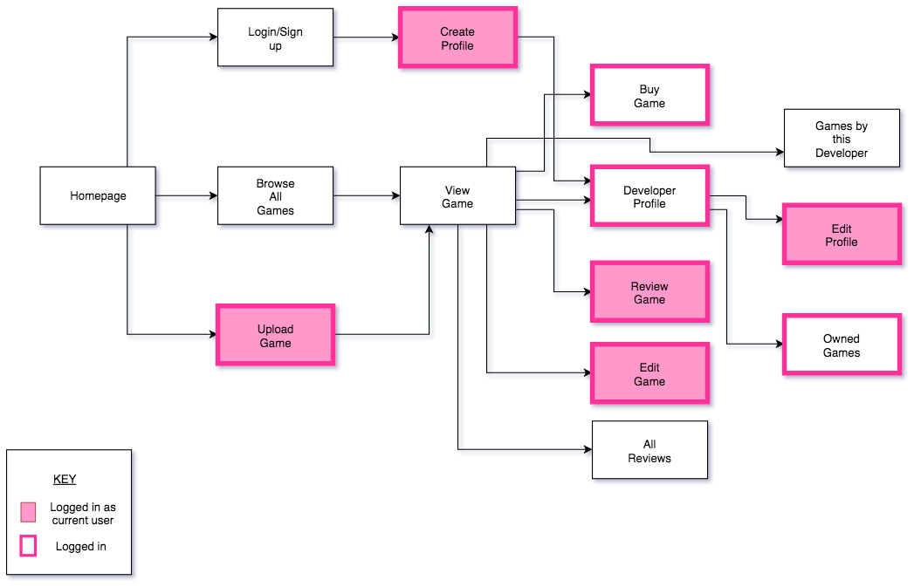

# flrish

Website URL: https://flrish.herokuapp.com/

GitHub Repo: https://github.com/rhyswoodberry/flrish

# Table of Contents

1. [What is flrish?](#what-is-flrish-?)

2. [Problem](#the-problem)

3. [Solution](#the-solution)

4. [User Stories](#user-stories)

5. [Detailed User Stories](#detailed-user-stories)

6. [Style Guide](#style-guide)

7. [Workflow](#workflow)

8. [ERD](#erd)

9. [Wireframes](#wireframes)

10. [Project Management](#project-management)

---

## What is *flrish*?

##### Flourish (verb)
  1. Grow or develop in a healthy or vigorous way, especially as the result of a particularly congenial environment.
  2. Develop rapidly and successfully.

**Flrish** is a marketplace for indie game developers to upload and sell their games to a passionate community of fans. 

It is designed to be a place where developers and customers can both have the best experience when it comes to buying and selling video games.

It is a community of like-minded, and passionate people to come together. For developers, it is a place where they can get a foot in the door and start selling their work. For customers, it is a place where they can support the things they love and help developers to grow.

---

## The Problem

There are so many ways for aspiring developers or indie developers to sell their games these days, however, it is also harder than ever to get your games noticed. Other markets are flooded with too many games, and don't have a community that promotes innovation, development and growth of video games as a medium. 

## The Solution

A marketplace-community that is solely for indie developers or aspiring developers to showcase and sell thier games to a passionate community. The website will allow users to easily find games they will love and allow developers and their games to **flourish**.

---

## User Stories

## Detailed User Stories

*Customers should be able to edit their details*

**Feature:** Edit customer profile

* As a customer
* I want to be able to edit my profile information
* So I can keep my information up to date

**Scenario:** Customer edits profile

* Given that I am a customer who is logged in
* When I go to view my profile information
* I should be able to edit the differnt fields by clicking 'edit'
* Then I should be able to click 'update'
* And my new information should be saved

---

*User should be able to search games by a particular developer without signing up or logging in*

**Feature:** Search games by developer

* As a user or potential user
* I would like to search for games by a developer
* Because I want to see what other games a certain developer has released

**Scenario:** Someone searches for a game

* Given I am a user who is either logged on or not logged
* When I type the name of a game developer in the search bar
* And click the search button
* I should see all the games uploaded by that developer

---

*Developers should be able to upload an image or images to better describe their game to customers*

**Feature:** Image upload for game submissions

* As a developer
* I want to add images to my game description
* So that my game descriptions are as acurate as possible for customers

**Scenario:** Developer uploads a game

* Given that I am a logged on developer
* When I am creating a new game upload
* I should be able to select an image from my local decice to upload
* And when I click the 'upload' button
* The image should appear on the game's store page

---

*User should be able to view the homepage and browse games without logging into an account*

**Feature:** Homepage and product browsing enabled without login

* As a user
* I want to view content on the site without logging in or signing up
* So that I can share the website with others who might be interested but don't want to commit to signing up yet

**Scenario:** User that is not logged in opens up homepage or browses games

* Given that I am a user who isn't logged in
* When I visit the site
* I want to see the homepage
* And browse all games

---

*Developers should be able to set a minimum price.*

**Feature:** Set a minimum price

* As a developer
* I want to set a minimum price
* So customers can choose to give more if they want

**Scenario:** Developer uploads game

* Given that I am a logged in Developer
* When I upload a game to sell
* I should have the option to set a minimum price for the game

---

*Customers should be able to set their own price*

**Feature:** Flexible pricing.

* As a customer
* I want to be able to pay more than the price set by the developer
* So that I can show my support for developers and games I really like

**Scenario:** Customer goes to checkout with a game

* Given that I am a logged in customer
* When I go to purchase a game at checkout
* I should be asked how much I would like to pay
* I should be able to type in a number higher than the listed price
* And the transaction should charge me the amount I specified

---

## Style Guide

**Logo**

**Colour Palette**

**Fonts**

*Headings font* 

Oleo Script conveys a fun and energetic style, which fits with the brand of the site.

*Main text font*

Nunito Sans is a modern, versitile font with several styles availible. It is easily legible on digital devices.

___

## Workflow

A preliminary look at the workflow of my website.

---

## ERD

MVP entity relationship diagram.

---

## Wireframes

I used Figma to desgin the wireframes for the website.

**Homepage**

**Browse Games**

**View Game**

**Profile**

**Sign In**

---

## Project Management

I used **Trello** to manage my project.

